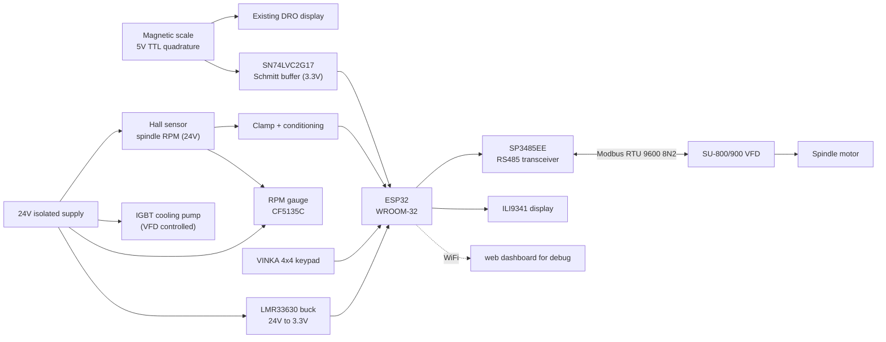
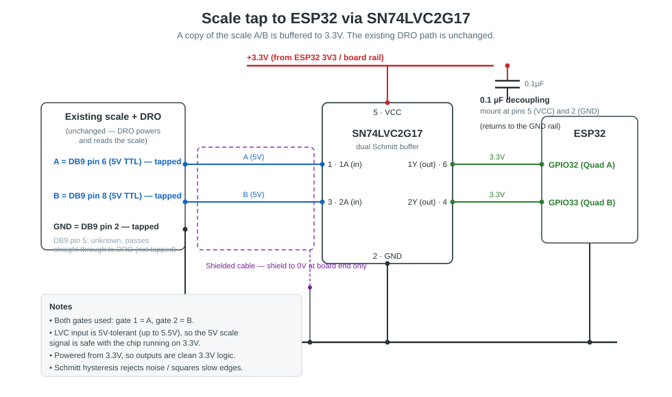
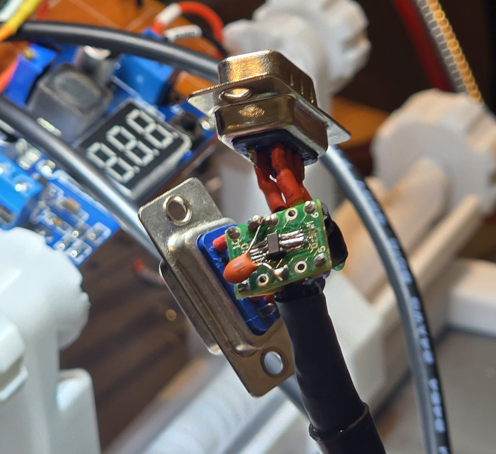

# CSS Controller

A constant surface speed (CSS) controller for a metal lathe, built around an ESP32, tapping into your existing DRO scale and using the readings to control a VFD using modbus.


## What it does

The controller keeps the cutting surface speed constant as the tool moves across the work.

On a lathe, a fixed spindle RPM means the surface speed at the cutting edge changes when the diameter changes.   This means that facing a part, instead of staying constant, the surface speed falls as the diameter shrinks and the cutting tool moves towards the centre of the part. To hold it steady, the spindle has to be told to speed up as the tool moves in. This is a feature on some of the newer lathes that you can buy but I've never seen a retro-fit product for this.

To get the current position, tt reads the cross-slide position from the lathe's magnetic DRO scale, works out the current diameter, and sets the spindle RPM so the surface speed of the cutting tool stays at a constant value.

The operator sets a target surface speed in metres per minute, and the controller handles the rest.

## How it works

The design is feed-forward. It computes the RPM the cut needs and sends speed commands over modbus, rather than measuring RPM and correcting.

The required spindle RPM is a direct calculation:

```
RPM = (surface speed x 1000) / (pi x diameter_mm)
```

The controller knows the target surface speed because you set it before cutting, then it measures the diameter from the scale and from there works out the target RPM.

The VFD already regulates the motor to whatever frequency it is given. I've connected a hall RPM sensor is used for display and for a safety purposes, but it doesn't control the RPM directly.

The control loop runs at 20 Hz. Each cycle it reads the scale, computes the diameter and target RPM, converts that to a VFD frequency, applies a slew-rate limit, and writes the setpoint over Modbus.

## Block diagram



## Hardware

| Component | Part | Role | Notes |
|---|---|---|---|
| Microcontroller | ESP32-WROOM-32 | Main controller | Dev board on the test rig; module on the custom PCB |
| Cross-slide position | Magnetic scale, 5V TTL quadrature | Diameter measurement | Single axis (cross-slide), tapped off the existing DRO |
| Scale buffer | SN74LVC2G17 (dual Schmitt) | Cleans and level-shifts scale A/B to 3.3V | 5V-tolerant input, 3.3V output; replaced an earlier 74HC245 and resistor dividers |
| Spindle RPM | Hall effect sensor, 24V, 1 pulse/rev | RPM measurement | Conditioned with a 22k series resistor and a 1N4148 clamp to 3.3V |
| RS485 transceiver | SP3485EE | Modbus link to the VFD | 3.3V native, ESD-protected; replaced a MAX485 |
| VFD | SU-800/900 series | Spindle drive | Modbus RTU, 9600 baud, 8N2, slave address 1 |
| Display | ILI9341, non-touch | Status display | HSPI at 40 MHz, landscape |
| Keypad | VINKA capacitive 4x4 | Operator input | I2C |
| RPM gauge | CF5135C | Separate spindle RPM readout | 8 to 24V, taps the same Hall signal |
| Rotary encoder | To be selected | Planned speed adjustment | Not yet integrated |
| Reset button | Momentary pushbutton | Clears a Modbus fault | On GPIO13 |

### Reading from the existing DRO Scale



I wanted to be able to plug everything in without it impacting any of the existing DRO functionality.  I had a number of tries at this that I couldn't get working and even if I did, the solution would have needed to be powered on for the DRO to work.

With the SN74LVC2G17 solution, the controller can be powered off and it doesn't impact the DRO.  The chip also buffers and converts the 5V scale voltage down to 3.3V that is safe for the ESP32 to consume.

On my scale, Quadrature A & B sit on pins 6 & 8 and ground is pin 2, so these 3 pins are tapped and used as input into the buffer.  The chip is powered by 3.3V from the controller, and the ground is shared.  Power (pin 7) is passed straight through, so the existing scale is still fed 5V.  For some reason, my scale also needs pin 5 to work, so that's passed straight through as well.



## GPIO pin map

| GPIO | Function |
|---|---|
| 32 | Quadrature A |
| 33 | Quadrature B |
| 14 | Hall sensor |
| 25 | Keypad SDA |
| 26 | Keypad SCL |
| 27 | Keypad INT |
| 22 | Display SCK |
| 23 | Display MOSI |
| 5 | Display CS |
| 4 | Display DC |
| 16 | Display RST |
| 17 | Display BL |
| 21 | RS485 TX (to transceiver DI) |
| 19 | RS485 RX (from transceiver RO) |
| 18 | RS485 DE/RE (direction) |
| 13 | Reset button |

## Power

The system runs from a single 24V isolated supply.

The 24V rail feeds the Hall sensor, the RPM gauge, and the pump that cools the VFD's IGBTs. A buck converter steps 24V down to 3.3V for the ESP32 and all the logic.

The logic is 3.3V only. Earlier versions used a 5V rail for a 74HC245 buffer and a MAX485. Both parts were removed or replaced with 3.3V parts, so the 5V rail is gone. The scale is powered by the DRO, not by this board.


## VFD configuration (SU-800/900)

Set these on the VFD keypad before use.

| Parameter | Value | Meaning |
|---|---|---|
| P0-02 | 0 | Command source: panel (the resting value) |
| P0-03 | 4 | Frequency source: keyboard potentiometer |
| P0-27 | 0900 | Communication command source is bound to the communication frequency setpoint |
| Pd-00 | 9600 | Baud rate |
| Pd-01 | 0 | Data format 8N2 |
| Pd-02 | 1 | Slave address |
| Pd-04 | approx 1.0s | Comms timeout (the drive stops if the controller goes silent) |

The controller switches only the command source. When CSS turns on, it writes P0-02 to 2 (communication) at the RAM address, which does not wear the EEPROM. The P0-27 binding then makes the drive take its frequency from the communication setpoint. When CSS turns off, the controller waits until the drive reports stopped, then writes P0-02 back to 0 (panel). The frequency source (P0-03) is never changed.

### Register map

| Register | Use |
|---|---|
| 0x1000 | Frequency setpoint, as a percentage of P0-10 in 0.01% units |
| 0x2000 | Run/stop command (1 forward, 2 reverse, 5 coast, 6 decel, 7 fault reset) |
| 0x1001 | Operating frequency read-back |
| 0x3000 | Status word (1 forward, 2 reverse, 3 stopped) |
| 0x8000 | Fault code |
| 0x0002 | P0-02 command source, RAM address |
| 0x0003 | P0-03 frequency source, RAM address |


## Firmware

- Hardware PCNT quadrature decoder with overflow handling for extended range.
- Hall RPM by hardware interrupt, with an adjustable debounce and a 2-second timeout that reads zero when the spindle stops.
- Modbus RTU master, function codes 03 (read) and 06 (write), with the CRC calculated inline.
- A frame reader that resyncs past a leading noise byte on the RS485 turnaround, so a phantom byte does not fail the CRC.
- Frequency setpoint with percentage conversion, a slew-rate limit, and min/max clamping.
- Command-source takeover when CSS turns on, and a deferred handback when it turns off. The handback waits for the drive to report stopped before returning control to the panel.
- A divergence guard that stops the spindle if the measured RPM strays too far from the commanded RPM, which catches a stall or a slipping belt. Off by default until the RPM reading is trusted.
- A Modbus failure counter that disables CSS after five failed transactions in a row.

## Web dashboard

The controller runs a web dashboard over WiFi. It shows live status and gives full control from a phone.

- Live status: state, target surface speed, frequency, position count, reference and current diameter, target and actual RPM.
- Link settings: baud rate, data format, and slave address, all changeable while running.
- An auto scan that sweeps every baud rate and data format looking for a reply from the drive.
- A debug console with three levels: off, errors, and frames. The frame view shows each Modbus frame in hex with a plain-English label of what it does, for example `(decel stop)` or `(set freq 10%)`. Repeated lines collapse into one with a running count.
- Tuning controls: Hall debounce time, and the divergence guard on/off and tolerance.


## Controls

Keypad, in normal mode:

| Key | Action |
|---|---|
| A | Enter an exact target surface speed |
| B | Enter an exact reference diameter |
| C | Stop |
| D | Zero the position |
| # | CSS on |
| * | CSS off |
| 5 / 0 | Surface speed +5 / -5 (hold to repeat) |
| Reset button (GPIO13) | Clear a Modbus fault |

Serial commands: `ref`, `css`, `on`, `off`, `stop`, `reset`, `zero`, `mbtest`, `mbscan`, `baud`, `fmt`, `addr`, `link`, `hallms`, `div on/off`, `divtol`, `divdelay`, `debug`, `logclear`, `status`, `help`.

## Build status

Working:

- Modbus link to the VFD through the SP3485EE
- Scale reading and cross-slide position
- Spindle RPM above about 320 RPM
- Speed control while cutting
- Web dashboard and serial interface
- Power supply, 24V to 3.3V

In progress:

- Shielding the scale cable
- Custom PCB design
- Rotary encoder interface

## Known issues

- **Hall RPM noisy below about 320 RPM.** The cause is coupled noise from the unshielded scale cable and the VFD. Testing showed the noise arrives at a fixed rate, so widening the debounce only moves the clean threshold and does not fix it. The plan is to shield the scale cable, route it away from the Hall and Modbus cables, and add the Schmitt buffer on the Hall line.
- **The command-source handback can time out and switch back during deceleration** if a noisy link disturbs the status read. Cleaning up the cable noise should resolve it.


## History

This project went through a long hardware bring-up. Notable points:

- The scales are single-ended 5V TTL, not differential, so the differential receiver and termination first planned were not needed.
- A touch ILI9341 was tried and abandoned for a non-touch panel plus a keypad.
- Two MAX485 modules failed before the cause was traced to a dead module and a floating ground, after which the design moved to the ESD-protected SP3485EE.
- An RS485 wiring error (RO, DI, and DE on the wrong GPIOs) caused a long silent-link fault that looked like noise.
- The move to 3.3V-only logic removed the 5V rail and simplified level shifting across the board.
